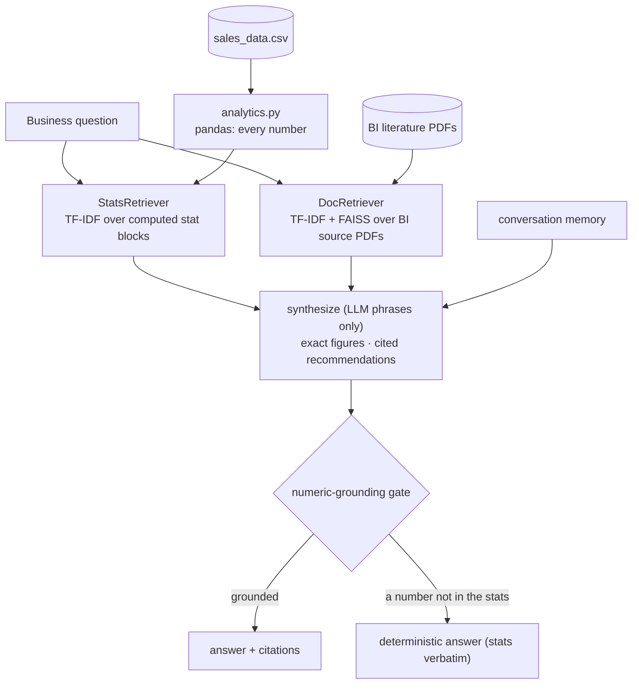

# InsightForge — AI-Powered Business Intelligence Assistant

[](https://github.com/smiley-icebox/insightforge/actions/workflows/ci.yml)
&nbsp;[](LICENSE)

A business-intelligence assistant you can trust on numbers. Ask it about your sales data
in plain English — best products, regional performance, trends, customer segments — and it
answers with the **exact figures**, plus **recommendations grounded in cited BI sources**.
Built for the Applied GenAI capstone, then extended toward a system you'd actually run.

> The dataset is synthetic (`data/sales_data.csv`, 2,500 records). Not financial advice.
> The qualitative layer reads BI PDFs from `data/sources/` — **bring your own** (the
> capstone's third-party papers aren't redistributed here; see `data/sources/README.md`).
> The quantitative assistant works fully without them.


## The one idea worth taking away

**The LLM never does math.** The #1 failure of "ask the LLM about your spreadsheet" tools
is confident wrong numbers. InsightForge fences the model out of arithmetic entirely:

- **pandas computes every statistic** (`analytics.py`) — totals, means, medians, std devs,
  shares, gaps — deterministically.
- a **custom retriever** maps a question to the relevant computed stat blocks
  (`retriever.py`); the LLM only **phrases** them.
- a **numeric-grounding gate** (`grounding.py`) checks that every figure in the answer
  traces to a retrieved statistic (or a cited source); if not, it ships the deterministic
  answer instead. So a fabricated number can't reach the user.

The same discipline applies to the qualitative side: **recommendations are grounded in,
and cited from, the BI literature** (a second RAG over the source PDFs) — the model can't
invent a source either.

## Architecture

Two grounded RAG layers — quantitative (computed stats) and qualitative (cited sources):



With `USE_LLM=0` the deterministic path runs end-to-end (no API key) — answers are the
computed statistics rendered directly, grounded by construction.

## Module map

| Module | Responsibility |
|--------|----------------|
| `config.py` | model, flags (`USE_LLM`, `USE_DOC_RAG`), paths, guardrail wording |
| `data.py` | load + structure the CSV (schema-validated, derived time/age columns) |
| `analytics.py` | deterministic stats engine — **the only place numbers are computed** |
| `retriever.py` | `StatsRetriever` (quantitative) + `DocRetriever` (qualitative, cited) |
| `grounding.py` | numeric-grounding gate (no fabricated figures) |
| `rag.py` | dual retrieval → chained prompt → grounded synthesis → citations |
| `memory.py` | conversation memory across turns |
| `insights.py` | deterministic, grounded "key insights" for the landing screen |
| `viz.py` | the four required charts (trend, product, region, demographics) |
| `evaluation.py` | QAEvalChain + deterministic gates over a versioned, computed-reference set |
| `app.py` | Streamlit: chat with **answer-linked charts** + provenance, landing insights, dashboard |

## Rubric coverage — every item, several exceeded

| Brief | Where |
|---|---|
| Data preparation · knowledge base | `data.py` (load/structure pre-cleaned CSV) |
| Advanced summary: time / product / region / demographics / median+std | `analytics.py` |
| RAG: pandas · **custom retriever for statistics** · prompt engineering | `analytics.py` + `retriever.py` + `rag.py` |
| Chain prompts | `rag.py` (`_SYSTEM` + structured context) |
| RAG system | `rag.py` (dual retrieval) |
| Memory integration | `memory.py` |
| QAEvalChain evaluation | `evaluation.py` |
| Visualizations (4 required) | `viz.py` |
| Streamlit UI | `app.py` |
| **Exceeds** | numeric-grounding gate · second cited RAG over BI literature · versioned computed-reference eval set · lint+CI · 30 offline tests |

## Run it

```bash
python3 -m venv .venv
.venv/bin/pip install -r requirements.txt

cp .env.example .env        # then put your key in it: ANTHROPIC_API_KEY=sk-ant-...
.venv/bin/streamlit run app.py
```

**No Anthropic key?** Set `USE_LLM=0` in `.env` — the whole app runs, answering with the
computed statistics directly (and the dashboard is fully offline regardless).

## Verify

```bash
.venv/bin/python -m pytest          # 30 tests, no API key needed (fully offline)
.venv/bin/python evaluation.py      # deterministic gates only (offline)
USE_LLM=1 .venv/bin/python evaluation.py   # + QAEvalChain correctness
```

The eval is a **versioned set whose gold answers are computed from the data** (so they
can't drift), scored on retrieval hit-rate@k + numeric grounding (deterministic) and
LangChain `QAEvalChain` accuracy (with a key).

## Documented, not built

Honest scope (see [SECURITY.md](SECURITY.md)): TF-IDF retrieval rather than semantic
embeddings (deterministic + CI-friendly; production would use an embedding model + managed
vector store), a single in-process CSV rather than a warehouse connector, and an
in-process conversation memory rather than persisted per-user history.
